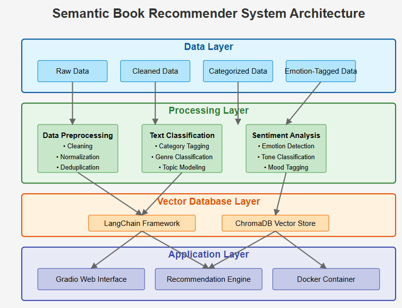
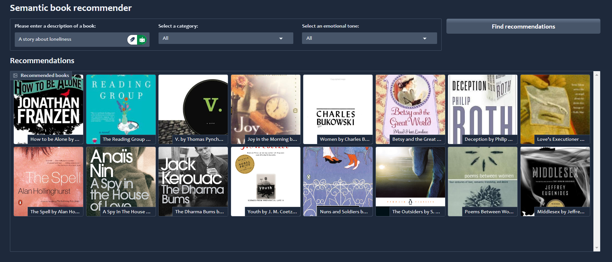

# Semantic Book Recommender System
[](LICENSE)
A semantic book recommendation system that combines content analysis with emotional tone filtering. Built with LangChain, ChromaDB, and Gradio.

) 


# Semantic Book Recommender System
[](LICENSE)
A semantic book recommendation system that combines content analysis with emotional tone filtering. Built with LangChain, ChromaDB, and Gradio.
()


## Features
- Semantic search using book descriptions
- Emotion-based filtering (Joy, Surprise, Anger, Fear, Sadness)
- Category filtering (Fiction, Nonfiction, etc.)
- Interactive Gradio interface
- Docker container support
- Data processing pipeline from raw to processed data

## Project Structure
```
├── data/
│ ├── raw/ # Original dataset
│ │ └── books.csv # Raw book data from 02/04/2020
│ ├── cleaned/ # Processed intermediate data
│ │ └── books_cleaned.csv # Cleaned version of raw data
│ └── processed/ # Final processed data
│ ├── books_with_categories.csv # Category-enriched data
│ ├── books_with_emotions.csv # Emotion-analyzed data
│ └── tagged_description.txt # Processed descriptions
├── notebooks/
│ ├── data-exploration.ipynb # Initial data analysis
│ ├── sentiment_analysis.ipynb # Emotion classification
│ ├── text_classification.ipynb # Category classification
│ └── vector-search.ipynb # Embedding experiments
├── app.py # Main application
├── Dockerfile # Container configuration
├── requirements.txt # Python dependencies
└── LICENSE # Apache 2.0 License
```

Install dependencies:
```
pip install -r requirements.txt
```

## Docker Setup
```
docker build -t book-recommender .
docker run -p 7860:7860 book-recommender
```

## Usage
1. Run the application:
```
python app.py
```
2. Access the interface at http://localhost:7860
3. Input parameters:
   - Book description (natural language)
   - Category filter (All/Fiction/Nonfiction/etc.)
   - Emotional tone filter (All/Happy/Surprising/etc.)

## Data Pipeline
- **Raw Data**: Original books.csv (4.1MB, 02/2020)
- **Cleaning**:
  - Remove duplicates
  - Handle missing values
  - Standardize formats
- **Processing**:
  - Category classification
  - Emotion analysis
  - Description tagging
- **Final Datasets**:
  - books_with_emotions.csv (7.1MB)
  - tagged_description.txt (2.6MB)

## Development Notebooks
- **data-exploration.ipynb**: Initial dataset analysis
- **sentiment_analysis.ipynb**: Emotion classification development
- **text_classification.ipynb**: Category tagging implementation
- **vector-search.ipynb**: Embedding and similarity search experiments


## Result



## License
Apache 2.0 License - See LICENSE for details.
